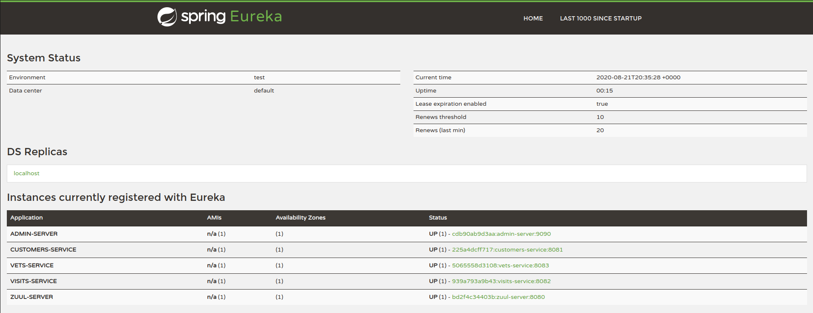

# My own version of the Spring PetClinic Sample Application built with Spring Cloud 

 

This microservices branch was initially derived from [Aray Spring Pet Clinic version](https://github.com/spring-petclinic/spring-petclinic-microservices) to demonstrate how to split sample Spring application into [microservices](http://www.martinfowler.com/articles/microservices.html).
To achieve that goal we use Spring Cloud Gateway, Spring Cloud Config and the Eureka Service Discovery from the [Spring Cloud Netflix](https://github.com/spring-cloud/spring-cloud-netflix) technology stack.

## ⚙️  Building

Docker:
`docker-compose build` 

Maven: `mvn clean install` 

##🚀 Starting services locally without Docker

Every microservice is a Spring Boot application and can be started locally using IDE ([Lombok](https://projectlombok.org/) plugin has to be set up) or `../mvnw spring-boot:run` command. Please note that supporting services (Config and Discovery Server) must be started before any other application (Customers, Vets, Visits and API).
Startup of Admin server is optional.
If everything goes well, you can access the following services at given location:
* Discovery Server - http://localhost:8761
* Config Server - http://localhost:8888 - [Config public repo link](https://github.com/erickmob/spring-petclinic-microservices-config)
* API Gateway - http://localhost:8080
* Customers, Vets and Visits Services - random port, check Eureka Dashboard or http://localhost:8080/{service-name}
* Admin Server (Spring Boot Admin) - http://localhost:9090

You can tell Config Server to use your local Git repository by using `native` Spring profile and setting
`GIT_REPO` environment variable, for example:
`-Dspring.profiles.active=native -DGIT_REPO=/projects/spring-petclinic-microservices-config`

##🚀 Starting services locally with docker-compose
In order to start entire infrastructure using Docker, you have to build images by executing `docker-compose build` 
from a project root. Once images are ready, you can start them with a single command
`docker-compose up`. Some containers needs others up before (like config-server and eureka-server). To do that, compose does health check and respect the `depends_on` properties. 
After starting services it takes a while for API Gateway to be in sync with service registry,
so don't be scared of initial Spring Cloud Gateway timeouts. You can track services availability using Eureka dashboard
available by default at http://localhost:8761.

*NOTE: Under MacOSX or Windows, make sure that the Docker VM has enough memory to run the microservices. The default settings
are usually not enough and make the `docker-compose up` painfully slow.*

## 🔰 Useful links/images for better understanding the Spring Petclinic application

[See the presentation of the Spring Petclinic Framework version](http://fr.slideshare.net/AntoineRey/spring-framework-petclinic-sample-application)

[A blog bost introducing the Spring Petclinic Microsevices](http://javaetmoi.com/2018/10/architecture-microservices-avec-spring-cloud/) (french language)

**Architecture diagram of the Spring Petclinic Microservices**

**Spring Boot Admin**

**Eureka**

